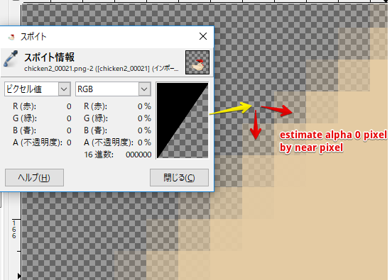

# Extreme Gpu Friendly Video Format

## what is this?
- Original file format optimized for random access at any frame
- Frame data is compressed DXT1, DXT3, DXT5 format
- Storage format is compressed by lz4

## setup for example (optional)

```

$ cd scripts
$ ruby download_resource.rb

```

## How to encode
We have to convert from image sequence to format(\*.gv).

If you don't have image sequence, you can encode to image sequence by ffmpeg.
Please install ffmpeg by brew(osx) or chocolatey(windows).
or png tiff sequence directly by like after effects or nearly tools.

### 1 (optional). create \*.gvintermediate(image seq) from any video file

```

$ cd scripts
$ ruby video_to_gvintermediate.rb footage.mov

```

### 2. Launch App Prebuild Binary Converter
https://github.com/Ushio/ofxExtremeGpuVideo/releases/tag/1.1.2

for win: nvtt_bach_converter_win
for mac: batch_converter_mac

but we recommend windows. nvtt encoder is fast, high quality.
mac converter is little bit slow ("no lite mode" quality is maybe nearly nvtt)

for mac, has "lite mode" option is fast mode.(because encode is very slow)

### 3. select Alpha Mode

### 4. Drag and drop image sequence folder.
imageseq/image000.tiff
imageseq/image001.tiff
imageseq/image002.tiff

please drag and drop imageseq folder to window.

and Press "Run" button.

### Wait
have a break

### How to Play
Plase check example-player-win or example-player-osx
** Player algorithm is exactly same win, mac. **

ofxGvTexture is Newer, and simple.

## binary file format (gv)

```

0: uint32_t width
4: uint32_t height
8: uint32_t frame count
12: float fps
16: uint32_t fmt (DXT1 = 1, DXT3 = 3, DXT5 = 5, BC7 = 7)
20: uint32_t frame bytes
24: raw frame storage (lz4 compressed)
eof - (frame count) * 16: [(uint64_t, uint64_t)..<frame count] (address, size) of lz4, address is zero based from file head

```

nvtt encoder supported
https://developer.nvidia.com/gameworksdownload#?dn=gpu-accelerated-texture-tools-2-08


## Prebuild Binary Converter
Latest 1.1.1<br>
https://github.com/Ushio/ofxExtremeGpuVideo/releases/tag/1.1.1

1.0.0<br>
https://github.com/Ushio/ofxExtremeGpuVideo/releases/tag/1.0.0

Unity Package<br>
https://github.com/Ushio/ofxExtremeGpuVideo/raw/master/Unity/gpuvideo.unitypackage

## estimate alpha zero color

