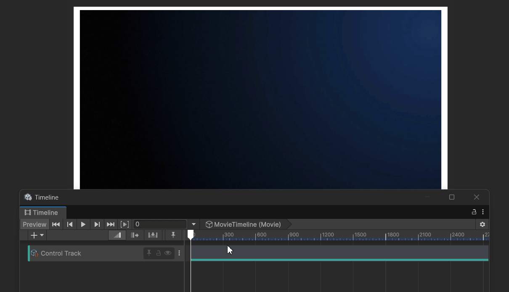
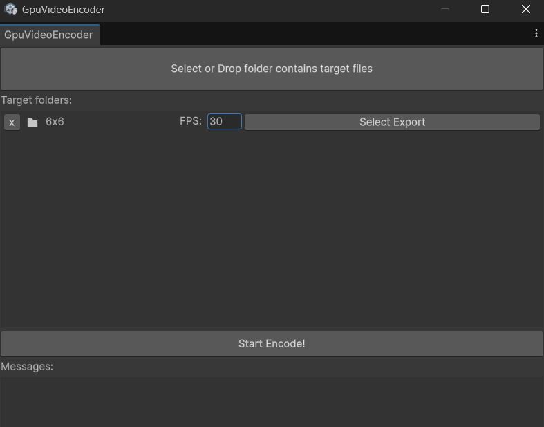

# Unity

This is a Unity project for a GpuVideo player and encoder.

## Supported Platforms

| Platform | TextureFormat |
| --- | --- |
| Windows, macOS | DXT1, DXT5 |
| iOS | ASTC 4x4, ASTC 5x4, ASTC 6x6, ASTC 8x8, ASTC 10x10, ASTC 12x12 |

## How to play

```cs
using UnityEngine;
using ExtremeGpuVideo;

public class ExamplePlayer : MonoBehaviour
{
    private GpuVideo video = null;    

    void Start()
    {
        string path = System.IO.Path.Combine(Application.streamingAssetsPath, "test.gv");
        video = new GpuVideo(path);
    }

    void Update()
    {
        float timeAt = Time.time % video.Duration;
        video.SetTime(timeAt);
    }
}
```

The standard player is implemented as ExtremeGpuVideo.GpuVideoPlayer.

### Timeline Support

By installing the UnityEngine.Timeline package, you can control GpuVideoPlayer using Timeline.



Enable the Define Symbol GPUVIDEO_SUPPORT_TIMELINE.

1. Open Project Settings.
2. Go to Player > Other Settings > Scripting Define Symbols.
3. Add `GPUVIDEO_SUPPORT_TIMELINE` to the list.

## How to encode

1. Launch the encoder from the menubar (ExtremeGpuVideo > Encoder).

2. Drag & drop the folder contains the sequential images.

    

    If you want to conver to GpuVideo in ASTC format, you need to convert the images ASTC format beforehand. Please use converters such as [ARM-Software/astc-encoder](https://github.com/ARM-software/astc-encoder).

    ```shell
    $ astc-encoder -cl <input> <output> 6x6 -medium
    ```

3. Set the fps and the export path.
4. Wait patiently...